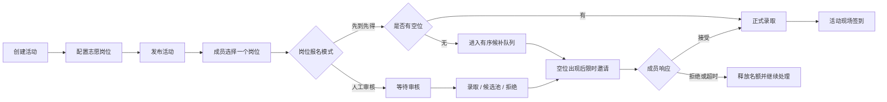
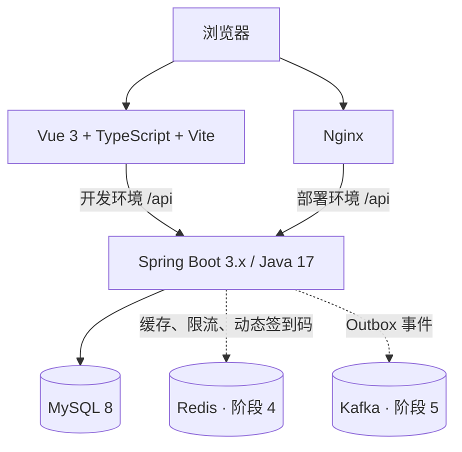

# VolunteerFlow

面向班级、学生社团和校园志愿组织的活动报名、岗位招募、候补递补、通知与签到协同平台。

> 当前状态：产品与技术设计已经确认，项目处于阶段 0（工程准备）。前后端代码工程尚未创建。本文中的功能描述是第一版建设目标，不代表已经实现。

## 为什么做这个项目

校园志愿活动通常通过 QQ 群等即时通信渠道发布，实际协作中容易出现以下问题：

- 活动消息被群聊淹没，成员容易错过报名和变更通知。
- 活动包含礼仪、疏导、讲解等不同岗位，但普通报名表难以分别管理名额和要求。
- 名额满员后缺少公开、可验证的候补规则。
- 正式成员临时退出时，负责人往往只能通过私聊人工寻找替补。
- 报名名单、候补名单、签到表和通知分散在不同工具中。
- 现场签到和事后统计缺少统一的数据记录。

VolunteerFlow 将活动、岗位、报名状态、候补递补、通知和签到放在同一套业务流程中，让成员清楚了解自己的状态，也让负责人减少重复协调。

## 核心业务流程

每个活动可以包含多个志愿岗位，每个岗位独立设置人数、报名模式、问题和候补规则。



示例：

```text
新生开学典礼
├─ 礼仪岗：10 人，人工审核
├─ 疏导岗：20 人，先到先得
└─ 讲解岗：8 人，人工审核
```

同一成员在同一活动中只能报名一个岗位。如需换岗，必须先取消原报名，再报名新岗位；新岗位不继承原来的候补顺序。

## 第一版功能范围

### 成员端

- 使用用户名和密码注册、登录，支持多设备独立会话。
- 通过邀请码加入组织。
- 在手机上浏览活动及岗位详情。
- 填写活动公共问题和岗位专属问题。
- 查看审核、录取、候补和递补邀请状态。
- 查看自己的候补名次和邀请倒计时。
- 接受或拒绝限时递补邀请。
- 主动取消报名并查看站内通知。
- 使用签到码完成活动签到。

### 管理端

- 创建组织并管理成员、邀请码、角色和权限。
- 创建、编辑、发布、变更、取消和结束活动。
- 为活动配置多个岗位及独立招募规则。
- 审核报名申请并管理无序候选池。
- 查看先到先得岗位的有序候补队列。
- 处理限时递补、签到场次和人工补签。
- 查看关键操作审计日志。

### 第一版不包含

- 支付、收费和退款。
- 地理围栏签到。
- 自动信用分、封禁或缺席处罚。
- 微服务拆分。
- 聊天室和 AI 功能。

聊天室、未读摘要、活动变更识别和资料问答将在核心版本稳定后作为第二版单独设计。

## 关键设计

### 岗位级招募

岗位是活动中的一级业务实体。每个岗位独立维护：

- 招募人数。
- `FIRST_COME`（先到先得）或 `REVIEW`（人工审核）模式。
- 岗位说明、服务时间和集合地点。
- 岗位专属报名问题。
- 候补队列或候选池。
- 递补邀请确认时限。

### 候补与名额预留

- 先到先得岗位按不可修改的候补序号自动递补。
- 人工审核岗位使用无固定顺序的候选池，由管理员选择递补成员。
- 递补邀请默认有效 2 小时，可配置为 30 分钟至 12 小时。
- 待确认邀请会暂时占用岗位名额，防止同一名额被重复分配。
- 拒绝或超时后释放名额；先到先得岗位自动处理下一人。

### 自定义 RBAC

- 平台预置稳定的权限编码。
- 每个组织可以配置自己的角色和权限组合。
- 每名组织成员在一个组织中只拥有一个角色。
- 创建组织时自动生成组织负责人、活动管理员和普通成员角色。
- 负责人角色始终拥有全部组织权限，且组织必须至少保留一名有效负责人。
- 所有关键授权变更都写入审计日志。

### 并发正确性优先

第一轮报名业务只依赖 MySQL，通过事务、行锁、唯一约束和状态条件更新保证：

- 岗位不超卖。
- 同一成员不重复报名同一活动。
- 邀请不能重复接受或过期后接受。
- 客户端重试不会生成重复有效记录。

Redis 在后续阶段作为缓存、限流、动态签到码和并发辅助，不作为最终正确性的唯一保证。Kafka 不进入报名主事务，只通过 Transactional Outbox 承载异步通知和领域事件。

## 技术架构



| 层级 | 技术 |
|---|---|
| 后端 | Java 17、Spring Boot 3.x、Spring Security 6 |
| 数据访问 | MyBatis-Plus、自定义 Mapper、Flyway |
| 前端 | Vue 3、TypeScript、Vite、Vue Router、Pinia、Axios |
| 数据库 | MySQL 8 |
| 工程增强 | Redis、Kafka、Transactional Outbox |
| 部署 | Docker Compose、Nginx |
| 测试 | JUnit 5、Testcontainers、Vitest、Playwright、k6 |
| 监控 | Actuator、Micrometer、Prometheus、Grafana |

后端采用模块化单体，不在第一版拆分微服务：

```text
backend
├─ auth
├─ organization
├─ rbac
├─ activity
├─ registration
├─ checkin
├─ notification
├─ audit
└─ infrastructure
```

MyBatis-Plus 用于常规 CRUD、分页和条件查询；报名抢占、容量统计、候补递补和 `SELECT ... FOR UPDATE` 使用明确的自定义 SQL。Flyway 是数据库结构变更的唯一入口。

## 仓库结构

```text
VolunteerFlow/
├─ backend/          # Spring Boot 工程，使用 IDEA 开发
├─ frontend/         # Vue 工程，使用 VS Code 开发
├─ deploy/           # Docker Compose 与 Nginx 配置
├─ docs/
│  ├─ presentation/  # 项目设计演示文稿
│  └─ specs/         # 正式设计规格
├─ PROJECT_CONTEXT.md
└─ README.md
```

当前 `backend/`、`frontend/` 和 `deploy/` 将在对应实施阶段创建。

## 当前状态

截至 2026-09-14：

- [x] 明确真实问题、目标用户和第一版范围。
- [x] 完成活动岗位、报名、候补、RBAC、签到和通知设计。
- [x] 确定前后端分离和模块化单体架构。
- [x] 完成正式设计规格。
- [ ] 初始化 Spring Boot 后端工程。
- [ ] 初始化 Vue 前端工程。
- [ ] 建立完整 Flyway 数据库迁移。
- [ ] 完成前后端健康检查联调。
- [ ] 实现第一版业务闭环。

正式规格见：[VolunteerFlow 修订版设计文档](docs/specs/2026-09-14-volunteerflow-revised-design.md)。

## 开发路线

| 阶段 | 主要目标 |
|---|---|
| 阶段 0 | 前后端工程、完整数据库迁移、MySQL Compose、统一错误与健康检查 |
| 阶段 1 | 认证、组织、邀请码、自定义 RBAC、活动与岗位 |
| 阶段 2 | 两层报名表、两种报名模式、候补/候选池、递补和审计 |
| 阶段 3 | 站内通知、签到、Nginx 和首次部署 |
| 阶段 4 | Redis、动态签到码、限流、缓存和并发压测 |
| 阶段 5 | Kafka、Outbox、幂等消费和补偿任务 |
| 阶段 6 | 自动化测试、监控、备份恢复和真实试用 |

若进度延期，优先保证活动、岗位、报名、取消、递补和通知主流程正确，不为展示效果压缩权限与并发验证。

## 本地运行

项目目前尚未创建可运行的前后端工程。阶段 0 完成后，本节将提供经过实际验证的启动方式，预计包括：

```text
1. 使用 Docker Compose 启动 MySQL
2. 在 IDEA 中运行 Spring Boot 后端
3. 在 VS Code 中启动 Vite 开发服务器
4. 前端通过 Vite 代理访问 /api 与 /actuator/health
```

在命令经过本地验证前，本 README 不提供可能失真的示例命令。

## 测试与验收目标

核心验收场景：

1. 创建包含多个岗位的活动。
2. 成员选择一个岗位报名。
3. 岗位满员后，新成员进入候补队列。
4. 一名正式成员取消报名。
5. 第一名候补收到限时邀请并接受。
6. 录取成员完成现场签到。
7. 报名、取消、递补和签到均有审计记录。

并发测试将模拟 100 名用户竞争多个岗位的有限名额，验证无超卖、无重复报名和无重复候补序号。用户数、延迟、吞吐量和错误率只使用实际测试结果，不预先编造。

第一版完成前还需要验证：

- 跨组织数据隔离和 RBAC 权限。
- Redis 正常与故障回退场景。
- Kafka 停机、恢复补发和重复消费场景。
- 数据库备份与恢复。
- 至少 10 名同学的真实或完整模拟试用。

## 文档

- [修订版完整设计规格](docs/specs/2026-09-14-volunteerflow-revised-design.md)
- [早期设计规格](docs/specs/2026-08-06-campus-volunteer-platform-design.md)
- [项目交接说明](PROJECT_CONTEXT.md)
- [项目设计演示文稿](docs/presentation/VolunteerFlow校园志愿活动平台完整设计.pptx)

## 开发约定

- 所有数据库结构修改必须新增 Flyway 迁移，不手工修改共享数据库。
- 密码、令牌、数据库凭据和其他密钥不得提交到 Git。
- 后端不能依赖前端隐藏按钮进行权限控制。
- 业务查询必须同时限制当前用户、组织和资源归属。
- 核心数据通过状态停用或取消，不物理删除。
- 关键业务修改需同步补充自动化测试与文档。

## 许可证

项目暂未指定开源许可证。在许可证明确前，默认保留所有权利。
